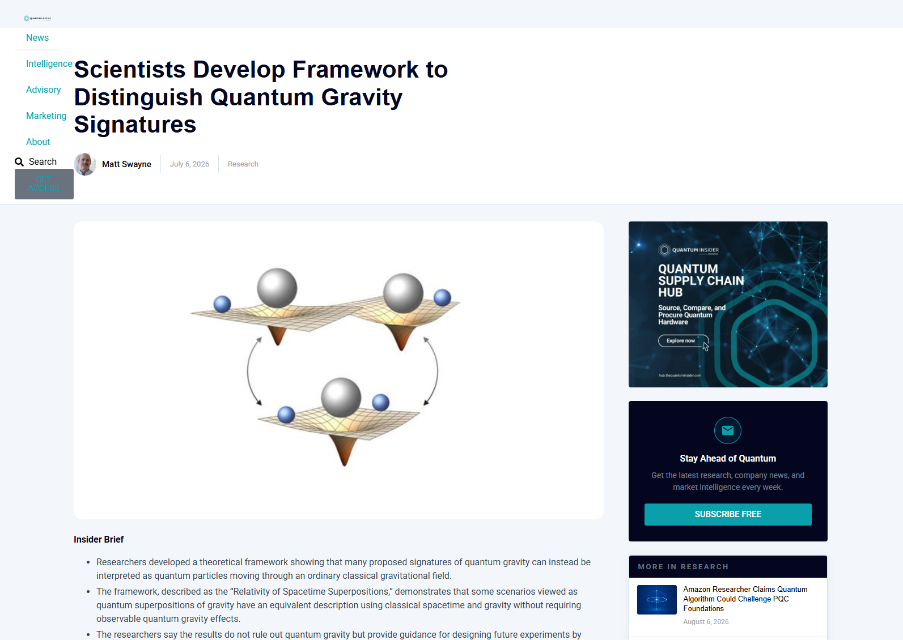
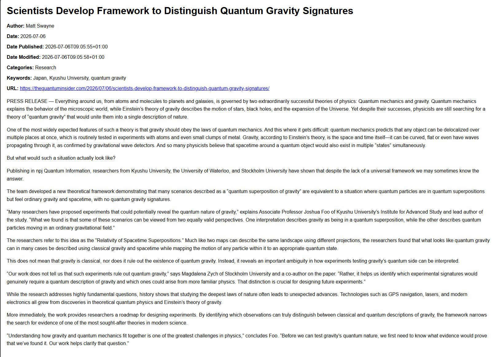
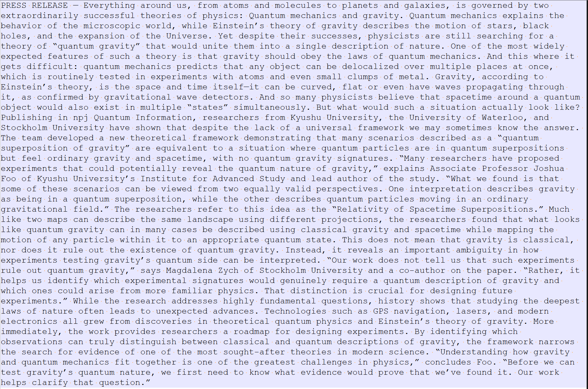
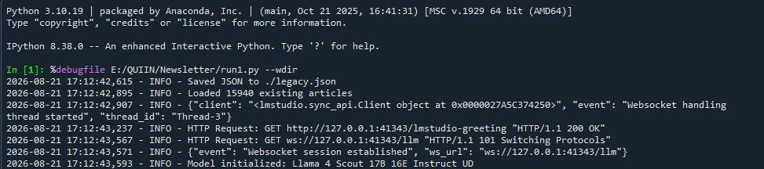
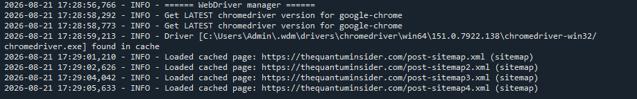
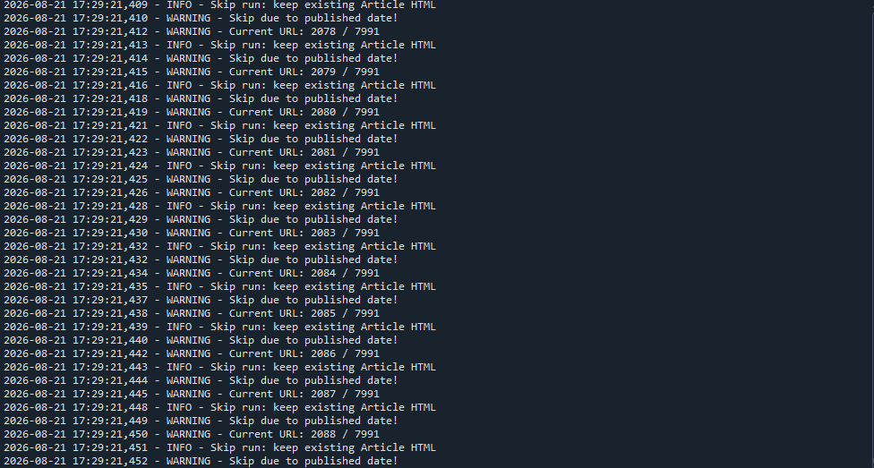
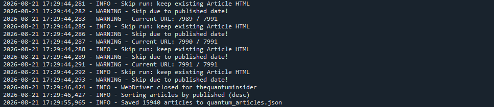
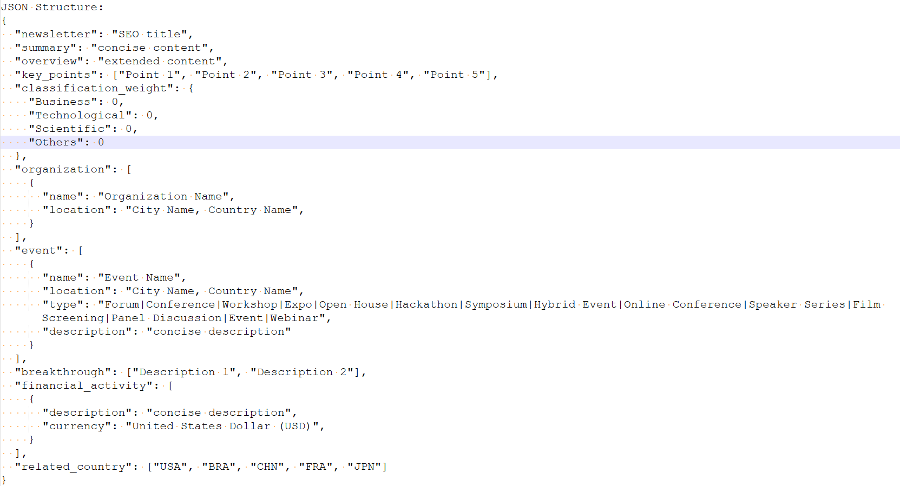
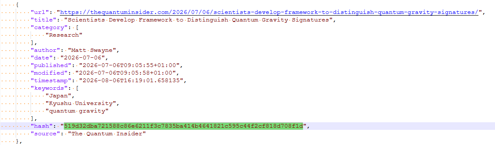
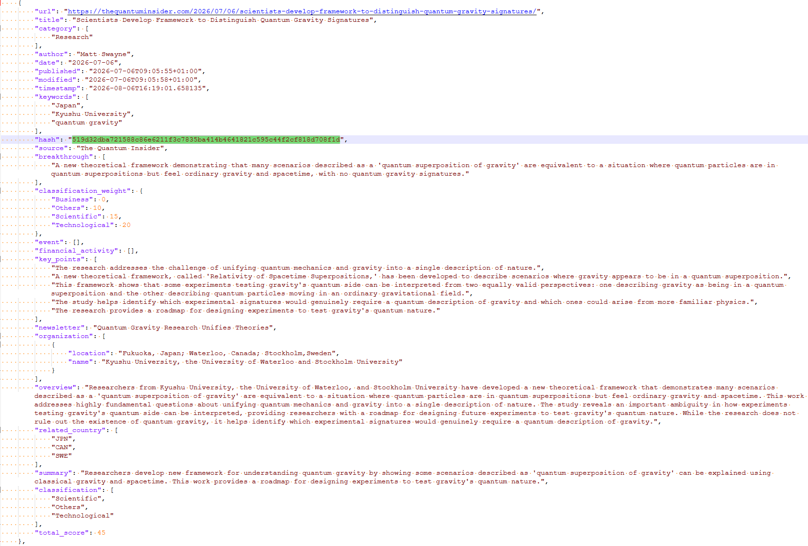

# Ferramenta de Processamento de Notícias - Newsletter

### Guia de Operação

Este documento descreve o funcionamento da Ferramenta de Processamento de Notícias (Newsletter) e serve como guia de referência para novos operadores responsáveis por sua execução.

---

## 1. Visão Geral

A ferramenta automatiza a coleta, o processamento e a extração de dados de notícias para alimentar a produção da newsletter.

O sistema identifica novas publicações a partir das estruturas de indexação mantidas pelos próprios portais de notícias (arquivos sitemap.xml). Essa abordagem funciona porque os portais normalmente limitam o acesso de um usuário convencional a um número reduzido de notícias, mas mantêm os endereços de todas as páginas livremente disponíveis nesses arquivos de indexação, já que a indexação atrai novos leitores e atende ao próprio interesse comercial do portal.

A partir da base de links atualizada, a ferramenta simula o acesso de um usuário convencional para salvar localmente cada página servida pelo navegador. As etapas seguintes de refinamento desses dados são detalhadas na seção 2.

A ferramenta suporta quatro portais de notícias, cada um com seu próprio módulo de coleta:

- `thequantuminsider.py` (The Quantum Insider)
- `quantamagazine.py` (Quanta Magazine)
- `quantumzeitgeist.py` (Quantum Zeitgeist)
- `insidequantumtechnology.py` (Inside Quantum Technology)

## 2. Conceito e Fluxo de Processamento

Cada notícia passa por três formatos intermediários antes de chegar à IA, cada um mais enxuto que o anterior:

- **Cache**: a página salva na íntegra, em HTML, com toda a carga estética e estrutural do site de origem.
- **Article**: versão simplificada em HTML, já sem os elementos de layout do portal, pronta para leitura e processamento rápido.
- **Content**: versão ainda mais reduzida, contendo apenas o conteúdo relevante da notícia, sem informações que não agreguem valor além do próprio texto. O objetivo é minimizar o volume de dados enviado à IA.

<p align="center"></p>
<p align="center"><i>Exemplo de arquivo Cache</i></p>

<p align="center"></p>
<p align="center"><i>Exemplo de arquivo Article</i></p>

<p align="center"></p>
<p align="center"><i>Exemplo de arquivo Content</i></p>

Com o arquivo Content pronto, a ferramenta encaminha o texto ao modelo de linguagem (LLM) usando templates de prompt com instruções precisas de saída. A IA retorna um JSON com estrutura e conteúdo definidos, e a ferramenta aplica mecanismos próprios de validação: se a resposta não atender ao formato esperado, o reprocessamento é automático. Esse desenho garante funcionamento autônomo, com resultados regulares mesmo sem supervisão constante.

Depois que o motor principal termina sua execução, uma ferramenta auxiliar consolida todos os dados extraídos e processados em uma base final, unificada e organizada.

## 3. Estrutura do Projeto

```
.
├── main.py                       # Interface gráfica desktop (CustomTkinter)
├── run.py                        # CLI: coleta + processamento via API de IA
├── merge.py                      # CLI auxiliar: consolidação da base final
├── core/                         # config_manager, api_client, preflight, task_runner, utils
├── scrapers/                     # Coletores: thequantuminsider, quantamagazine,
│                                 # quantumzeitgeist, insidequantumtechnology
├── gui/                          # app, frames (home/settings/scraper/results/log),
│                                 # components (sidebar/status/dialogs), theme
├── tests/                        # Suíte pytest do núcleo (core/)
├── template/                     # Templates de prompt, schema JSON e HTML em uso
├── legacy/                       # Código e templates superados, mantidos como referência
├── requirements.txt
├── requirements-dev.txt
└── .gitignore
```

Os diretórios `cache/`, `article/`, `content/` e `parse/`, além dos arquivos `cache.json`, `legacy.json` e `console.txt`, são criados e mantidos automaticamente pela ferramenta durante a execução. Eles não fazem parte do repositório (ver `.gitignore`).

## 4. Ambiente e Dependências

Ambiente:

```
Python 3.10+
```

Recomenda-se um ambiente virtual isolado (nenhuma etapa exige permissão
de administrador):

```
python -m venv .venv
.venv\Scripts\activate
pip install -r requirements.txt
```

Para desenvolvimento/testes, instale também `requirements-dev.txt`
e rode a suíte com `python -m pytest tests -q`.

A integração com IA usa provedores via API (Groq, OpenRouter, NVIDIA NIM,
OpenAI ou endpoint personalizado) através do cliente unificado
`core/api_client.py`. A antiga dependência do LM Studio local (`lmstudio`)
foi removida.

## 5. Execução

### 5.0 Interface Gráfica (recomendado)

```
python main.py
```

Fluxo de operação para o usuário:

1. Em **⚙️ Configurações**, escolha o provedor de IA, cadastre a API key
   (guardada no cofre do sistema operacional), escolha o modelo e os
   portais, e clique em **🔗 Testar Conexão**.
2. Em **🚀 Execução**, confira o pré-voo (navegador, driver, internet, chave,
   conexão com o provedor, diretórios e templates), ajuste as opções
   (incluindo **A partir de**, o filtro de data mínima) e clique em
   **▶ Iniciar Pipeline**. O progresso e os logs aparecem em tempo real.
3. Em **📊 Resultados**, navegue pela base consolidada (`documents-data.json`)
   e exporte CSV se necessário.

As configurações ficam em `~/.newsletter_tool/` (pasta do usuário).
O ChromeDriver é baixado para `~/.wdm/` (pasta do usuário).
Nada exige permissão de administrador.

### 5.1 Linha de Comando (headless)

A execução por CLI ocorre em duas etapas, nesta ordem:

- `python run.py`: motor principal. Coleta, processa e extrai as notícias.
- `python merge.py`: ferramenta auxiliar. Consolida os dados na base final.

`run.py` lê provedor, modelo, portais e filtro de data do arquivo de
configuração (`~/.newsletter_tool/config.json`), com sobrescrita por flags:

- `--debug`: ativa logs detalhados (nível DEBUG) e salva arquivos auxiliares para depuração.
- `--ignore-cache`: ignora o cache local e baixa novamente todas as páginas.
- `--provider`, `--model`, `--api-key`, `--min-date`, `--portals`: sobrescrevem o config.

Por padrão, apenas o portal The Quantum Insider está habilitado no config.
Para incluir outro portal pela CLI, passe `--portals`
(ex.: `--portals thequantuminsider,quantamagazine`).

### 5.2 Motor Principal (run.py)

A execução do motor principal passa por cinco estágios, descritos a seguir.

**Estágio 1: Carregamento do Modelo**

O motor inicializa o cliente do provedor de IA configurado (Groq, OpenRouter, NVIDIA NIM, OpenAI ou endpoint personalizado). O log confirma o provedor e o modelo em uso.

<p align="center"></p>
<p align="center"><i>Estágio 1: inicialização do cliente do provedor de IA</i></p>

**Estágio 2: Carregamento do Scraper**

A ferramenta inicializa o WebDriver (via webdriver-manager), responsável por simular o navegador que acessa e baixa as páginas de notícias.

<p align="center"></p>
<p align="center"><i>Estágio 2: inicialização do WebDriver</i></p>

**Estágio 3: Identificação de Notícias**

Com o driver pronto, a ferramenta carrega os arquivos sitemap.xml do portal configurado para localizar novas notícias e atualizar a base local de links.

<p align="center"></p>
<p align="center"><i>Estágio 3: leitura dos arquivos sitemap.xml</i></p>

**Estágio 4: Extração e Processamento de Notícias**

Para cada link identificado, a ferramenta verifica se a notícia já foi processada anteriormente. Quando o HTML já existe e está atualizado, o registro existente é mantido e a notícia é pulada (mensagens "WARNING - Skip due to published date!"), evitando reprocessamento desnecessário em execuções subsequentes.

<p align="center"></p>
<p align="center"><i>Estágio 4: verificação de notícias já processadas</i></p>

**Estágio 5: Compilação dos Resultados**

Ao final da varredura, a sessão do WebDriver é encerrada, as notícias são ordenadas por data de publicação (mais recentes primeiro) e o resultado consolidado é salvo em quantum_articles.json.

<p align="center"></p>
<p align="center"><i>Estágio 5: encerramento e gravação do resultado</i></p>

### 5.3 Ferramenta Auxiliar (merge.py)

Após a execução do motor principal, execute merge.py para consolidar os dados extraídos e processados pela IA na base final utilizada na produção da newsletter (documents-data.json).

## 6. Estrutura de Saída

O arquivo final segue a estrutura abaixo, definida pelo template de prompt enviado à IA:

<p align="center"></p>
<p align="center"><i>Estrutura JSON de saída definida no template de prompt</i></p>

Principais campos:

- `newsletter`: título otimizado para SEO.
- `summary` / `overview`: versões resumida e estendida do conteúdo.
- `key_points`: lista dos pontos-chave da notícia.
- `classification_weight`: pesos atribuídos pela IA a cada categoria (Business, Technological, Scientific, Others), usados para priorizar o conteúdo da newsletter.
- `organization` / `event`: organizações e eventos mencionados na notícia, com localização.
- `breakthrough`: descrições de avanços relevantes identificados na notícia.
- `financial_activity`: valores e descrições de atividades financeiras mencionadas.
- `related_country`: países relacionados ao conteúdo da notícia.

### 6.1 quantum_articles.json

Gerado pelo motor principal (run.py), este arquivo mantém o registro bruto de cada notícia coletada: URL, título, categoria, autor, datas de publicação e modificação, palavras-chave e um hash de verificação, usado para identificar duplicidades e mudanças de conteúdo.

<p align="center"></p>
<p align="center"><i>Exemplo de registro em quantum_articles.json</i></p>

### 6.2 documents-data.json

Gerado após o processamento pela IA e consolidado por merge.py, este arquivo contém a versão enriquecida de cada notícia, já classificada e estruturada conforme o padrão descrito na seção 6, pronta para uso na newsletter.

<p align="center"></p>
<p align="center"><i>Exemplo de registro em documents-data.json</i></p>

## 7. Observações para o Operador

- As mensagens "WARNING - Skip due to published date!" são esperadas em execuções repetidas: indicam que a notícia já foi processada e está atualizada, não um erro.
- O campo `hash` em quantum_articles.json permite à ferramenta detectar duplicidades e mudanças de conteúdo sem reprocessar tudo a cada execução.
- Se a IA retornar um JSON fora do formato esperado, a própria ferramenta identifica a falha e reprocessa o item automaticamente, sem necessidade de intervenção manual.
- Sempre execute run.py antes de merge.py: a ferramenta auxiliar depende da base gerada pelo motor principal.
- O log completo de cada execução é salvo em console.txt, na raiz do projeto.
- A pasta `legacy/` guarda código e templates superados, mantidos apenas como referência histórica (ver `legacy/README.md`).
